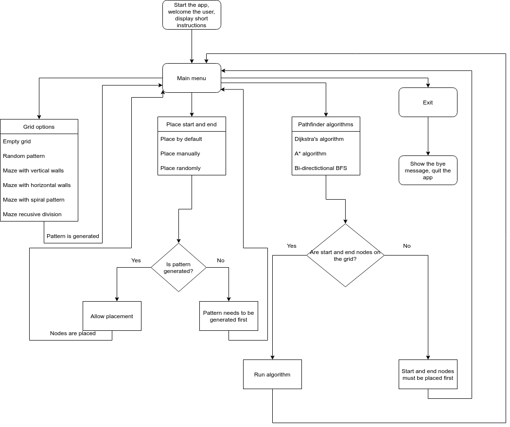
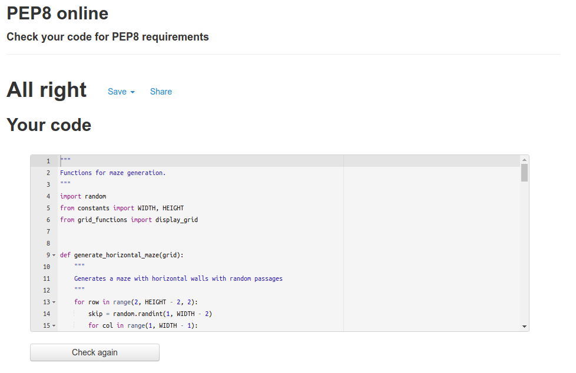

# Pathfinding algorithms visualizer
[Pathfinding algorithms visualizer](https://python-algorithm-visualizer.herokuapp.com/) is a python terminal application that allows the user to understand how the pathfinding algorithms work by visualizing them in the terminal.

Users can generate different patterns and mazes on the provided grid, place the start and end points, and then run the algorithms to find the shortest path between them.

---

### How to use    

1. Open this [link](https://python-algorithm-visualizer.herokuapp.com/) or copy it from here: `https://python-algorithm-visualizer.herokuapp.com/`, paste it into your browser's address bar, and press enter.
2. When the page is loaded, click the "RUN PROGRAM" button.
3. Navigate through the menu options using the arrow keys on your keyboard, press enter to choose an option.
4. First, you will need to choose the type of pattern you want to generate in the "Grid options".
5. Then, you will need to place the start and end points on the grid in the "Place start and end node".
6. Finally, you will need to choose which algorithm you want to run in "Pathfinder algorithms".

---

### User stories

- As a first-time visitor, I want to be able to understand the main purpose of the application.
- As a first-time visitor, I want to be able to see the instructions on how to use the application.
- As a first-time visitor, I want to be able to see the different types of patterns that can be generated.
- As a first-time visitor, I want to be able to see the different algorithms that can be used to find the shortest path between the start and end points.
- As a user, I want to be able to see how the algorithms work with different patterns and different start and end nodes placement on the grid.
- As a user, I want to be able to change the pattern type, start and end nodes placement, and algorithm without restarting the application.

---

### Features
- ##### The welcome message.
After the application is loaded, the user can see the welcome message and short instructions on how to use the application.

- ##### Main menu.
Under the welcome message, the user can see the main menu.

- ##### Grid options menu.
The first option in the main menu is the "Grid options". Here, the user can choose the type of pattern that will be generated on the grid.

1. Empty grid: The grid will be empty with the wall border around it.

2. Random pattern: The grid will be filled with random walls and empty spaces.

3. Maze with vertical walls: The grid will be filled with vertical walls with one random passage in each of them.

4. Maze with horizontal walls: The grid will be filled with horizontal walls with one random passage in each of them.

5. Maze with spiral pattern: The wall on the grid will be generated in a spiral pattern.

6. Maze recursive division: The maze on the grid will be generated using the recursive division algorithm.

- ##### Place start and end node menu.
The second option in the main menu is the "Place start and end node". Here, the user can place the start and end points on the grid.

1. Place by default: The start node will be placed in the top left corner, and the end node will be placed in the bottom right corner.

2. Place randomly: The start and the end node will be placed randomly in empty spaces on the grid.

3. Place manually: The user will be able to place the start and end node on the grid using the arrow keys on their keyboard.

- ##### Pathfinder algorithms menu.
The third option in the main menu is the "Pathfinder algorithms". Here, the user can choose which algorithm will be used to find the shortest path between the start and end points.

1. Dijkstra's algorithm: The algorithm will find the shortest path between the start and end points using Dijkstra's algorithm. In our case, it works as the breadth-first search algorithm because all the nodes on the grid are connected and have the same weight (distance equals 1). As we can see in the screenshots, the algorithm starts from the start node and explores the grid in all directions until it reaches the end node.

2. A* (A star) algorithm: This algorithm is very similar to Dijkstra's and Breadth-first search algorithms. The difference is that the algorithm uses the heuristic function to calculate the distance between the start and end points. The heuristic function is the distance between the start and end points. In our case, the heuristic function is the Manhattan distance. As we can see in the screenshots, the algorithm starts from the start node and explores the grid in directions that have the shortest distance to the end node.

3. Bi-directional BFS (breadth-first search): This algorithm is running in both directions. It starts from the start node and the end node simultaneously and explores the grid in all directions until it finds the intersection between the two paths. 

- ##### Exit.
The last option in the main menu is the "Exit". Here, the user can exit the application and see the bye message.

 

---

### Flowchart
In the following flowchart, you can see the basic logic of the application.

---

### Technologies used

###### Languages

- [Python](https://www.python.org/): The main language used to develop the application.
- [JavaScript](https://www.javascript.com/): The language used by the Code Institute to run the mock terminal in the browser.
- [HTML](https://www.w3schools.com/html/): The language used by the Code Institute to create the layout needed to run the mock terminal in the browser.

###### Frameworks, libraries, and packages
- [random](https://docs.python.org/3/library/random.html): used to generate random numbers.
- [numpy](https://docs.scipy.org/doc/numpy/reference/): used to generate a 2d array used to represent the grid.
- [time](https://docs.python.org/3/library/time.html): sleep function from the time library was used to make every step of the grid update visible to the user.
- [blessed](https://pypi.org/project/blessed/): used to manipulate the terminal output.
- [simple-term-menu](https://pypi.org/project/simple-term-menu/): used to create the terminal menu for the application.

###### Other tools
- [Git](https://git-scm.com/): used to manage the application source code.
- [GitHub](https://github.com/): used to host the application source code.
- [Visual Studio Code](https://code.visualstudio.com/): used to edit the application source code.
- [Chrome](https://www.google.com/chrome/): used to run the application in the browser.
- [Draw.io](https://www.draw.io/): used to create the flowchart.

---

### Bugs and issues

- ###### Solved bugs

1. After deploying the application to Heroku, I noticed that the grid was not displayed correctly; all emojis used to represent the walls were overlapping. It was because the emojis were wider than the standard character width in the mock terminal provided by the Code Institute.

    + *Solution*:

        - I changed the code in the `display_grid` function:
        from this:
        `print("".join(str(node) for node in row))`
        to this:
        `print(" ".join(str(node) for node in row))`
        
        - Also, when running the app on the desktop, I used the ideographic space Unicode character (U+3000) instead of the standard space character (U+0020) as an empty space on the grid because its width equals the width of the wall emojis. But for correct display on the mock terminal, I used the standard space character (U+0020).

2. There was a bug in the function `generate_vertical_maze(grid)`. Some walls were left without passages, and some had more than one.
    + *Solution*:

        - Instead of using the built-in python list for the grid, I used a NumPy array. It was easier to make sure I didn't skip any walls, using NumPy array slicing: `grid[:, col][i].make_wall()` - gives us the whole column.

3. Many minor bugs during the application development were solved by manual testing and tweaking.

- ###### Unsolved bugs

1. The mock terminal that the Code Institute has provided freezes sometimes, and all you can do is rerun the application. I don't know if it's the mock terminal's fault or Heroku's fault. Also, the terminal screen is blinking sometimes if you run the application on Heroku.

---

### Testing
The application was tested manually during the whole development process. Ubuntu terminal was used to run the application locally, and the mock terminal provided by the Code Institute was used to run the application in the browser.

###### Validator results

[PEP8 online validator](http://pep8online.com/) was used to check the code for meeting PEP8 requirements. No warnings or errors were found. The results of the validator are in the screenshots below.

- `run.py`:

- `constants.py`:

- `node_class.py`:

- `grid_functions.py`:

- `maze_functions.py`:

- `pathfinding_algorithms.py`:

---

### Deployment

The application was deployed to [Heroku](https://www.heroku.com/) and can be accessed from the following link: [Pathfinding algorithm visualizer](https://python-algorithm-visualizer.herokuapp.com/)

**The steps to deploy the application to Heroku are:**

1. Create a Heroku account if you don't have one.

2. In the dashboard, go to the "Apps" tab.

3. Click on the "New" button and choose "Create a new app".

4. Enter a name for the app.

5. Choose a region.

6. Click on the "Create" button.

7. Open the app you created and go to the "Settings" tab.

8. At the "Config Vars" section, click on the "Add" button and enter the following:

    - key: `PORT`
    - value: `8000`

9. At the "Buildpacks" section, click on the "Add" button and choose:

    - Python
    - Node.js
    The order of the buildpacks is important.

10. After that, click on the "Deploy" tab.

11. At the "Deployment method" section, choose GitHub and connect your GitHub account.

12. Then, you need to choose the repository you want to deploy.

13. Go down to the "Manual deploy" section, choose the branch you want to deploy, and click on the "Deploy branch" button.

14. The application will be deployed to Heroku. You can access it by clicking on the "View" button.

**The steps to run the application locally on your machine are:**

1. The application requires you to have Python 3 installed on your machine.

    - If you are using Windows, you can download Python 3 from [Python website](https://www.python.org/downloads/windows/).

    - If you are using Linux, the Python 3 installation is probably already included in your distribution, but if not, you can install it by running the following command in your terminal:

        + For Ubuntu or other Debian based distributions: `sudo apt-get install python3`
        + For Fedora or other Red Hat based distributions: `sudo yum install python3`
        + For Arch Linux based distributions: `sudo pacman -S python3`
        + Other installation instructions can be found [here](https://www.python.org/downloads/).

    - If you are using macOS, you can download Python 3 from [Python website](https://www.python.org/downloads/macosx/).

2. Now, you need to download the application source code from GitHub.

    + Go to the GitHub repository, click on the "Download ZIP" button, and extract the zip file's contents to the folder where you want to place the application.

    + Or use the following command to download the application source code:
        + `git clone https://github.com/lexach91/algorithm-visualizer.git`

3. Now, you need to install the dependencies.

    + Navigate to the folder where you placed the application source code and run the following command:
        + `pip3 install -r requirements.txt`

4. (**IMPORTANT**) Before running the application on your machine, you will need to change the following code:

    + In the `constants.py` file, find these two lines:

    

    Uncomment the first line and comment the second one. Also, you can change the WIDTH and the HEIGHT constants to make the grid larger or smaller (choose the odd numbers).

    + In the `grid_functions.py` file:

        - find the function `display_grid`:
        
        Change the `print(" ".join(str(node) for node in row))` line to `print("".join(str(node) for node in row))`.

        - find the functions `place_start_node_manually` and `place_end_node_manually`:
        
        
        In both functions, change the `print(" ".join(str(node) for node in row))` line to `print("".join(str(node) for node in row))`.

5. Now, you can run the application on your machine by running the following command:
    + `python3 run.py`
    
6. *P.S. Running the application on your machine will provide much more enjoyable experience than running it on Heroku.*

---

### Credits

- The inspiration for creating this application came from discovering [Pathinding Visualizer](https://clementmihailescu.github.io/Pathfinding-Visualizer/) by [Clement Mihailescu](https://www.youtube.com/channel/UCaO6VoaYJv4kS-TQO_M-N_g) and by watching youtube videos by [Tim Ruscica](https://www.youtube.com/channel/UC4JX40jDee_tINbkjycV4Sg).

- The idea of using emojis as grid items in the terminal was inspired by this unusual [Snake Game](https://replit.com/@ykdojo/snake-game-but-youre-the-food) made by the creator of youtube channel [CS Dojo](https://www.youtube.com/c/CSDojo).

- The template for running the application in the mock terminal in the browser was provided by [Code Institute](https://www.codeinstitute.net/).